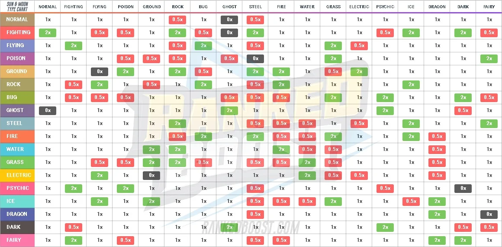

# Poké Graph



Credit [https://rankedboost.com/pokémon-sun-moon/type-chart/](https://rankedboost.com/pokémon-sun-moon/type-chart/)

- [Example Implemention](https://neo4j.com/blog/pokégraph-gotta-graph-em-all/)
- [Styling Reference](http://guides.neo4j.com/browser.html)

## Setup

- Install NodeJS 12+ with NPM
- Install Docker and Docker Compose
- Create the .env file in the project's root directory and copy and paste the content of the `.env.example` file into it
- Run the Neo4j container from your terminal with `docker-compose up -d` from the project's root directory; you can check that it's running with `docker container ls`, the container will be called `poké-graph_neo4j`
- Seed Neo4j with data by running `npm run load`
- Connect to the Neo4j graph explorer:
  - Navigate your browser to [http://localhost:7474](http://localhost:7474)
  - Log in:
    - Connect URL: **`bolt://localhost:7687`**
    - Authentication type: `Username / Password`
    - Username: `neo4j`
    - Password: `pokemon`

## Teardown

- Stop the containers with `docker-compose down --remove-orphans` WARNING: The stopping the containers or otherwise exiting Docker will kill any data you have stored in it. This is great for experimenting as it's easy to flush data and start fresh with the loaders but bad if you've entered a bunch of information into your local volume that you want to keep.

## Sample Neo4j Explorer Queries

- **find all Types**

```Cypher
MATCH (t:Type)
WITH t
ORDER BY t.name ASC
RETURN t AS type
```

- **find all Types a FIGHTING Type is Super Effective against**

```Cypher
MATCH (:Type { name: 'FIGHTING' })-[:AGAINST_TYPE { strength: 'SUPER_EFFECTIVE' }]->(d:Type)
WITH d
ORDER BY d.name ASC
RETURN d AS type
```

- **find all Type-strengths for a FIGHTING Type**

```Cypher
MATCH (:Type { name: 'FIGHTING' })-[r:AGAINST_TYPE]->(d:Type)
WITH r, d
ORDER BY r.strength ASC, d.name ASC
RETURN r.strength AS strength, COLLECT(d) AS type
```
